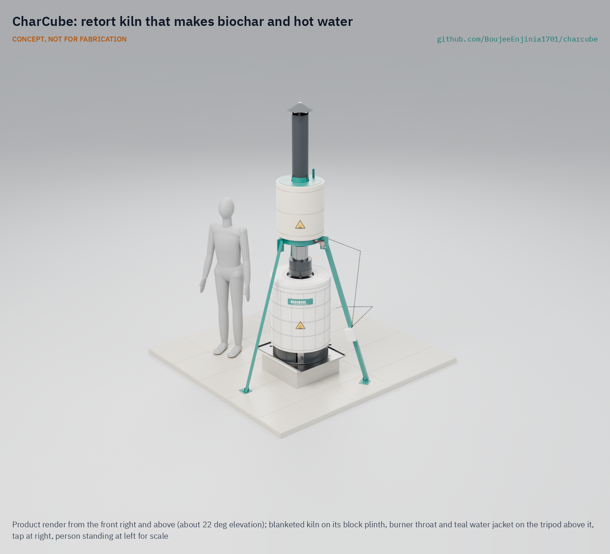

# CharCube

     

**Area:** CleanTech · **TRL:** 3 of 9 (proof of concept on paper; TRL 4 on hold) · **Prototype budget:** $320 USD (kiln parts estimated at $319; safety kit listed separately) · **Difficulty:** 2 of 5

Batch retort kiln that turns biomass into biochar, with a secondary burner that cleans up the syngas and a jacket that recovers heat for hot water.

[Exploded render](media/render-exploded.png) · [Detail render](media/render-detail.png) · [Interactive 3D model](media/viewer.html) · [Concept blueprint (PDF)](media/concept-blueprint.pdf) · [General arrangement CCB-DWG-001 (PDF)](cad/drawings/CCB-DWG-001.pdf) · [Calculations CCB-CAL-001](docs/04-calcs/01-sizing.md) · [Review note](docs/REVIEW.md)

## Concept rationale

A retort keeps air away from the residue, so it chars instead of burning, and the gas it gives off is burned in the kiln rather than vented. Nesting one steel drum inside another is the simplest way to build that: the gas fire in the gap heats the retort, a burner throat cleans up what is left, and the same flue heats water in an open jacket. Drums, plain pipe, bolts and one welded tank are available almost anywhere crops are grown, so the design can be copied by a village fabricator or a college workshop.

Publishing it as open hardware matters because low-cost kilns rarely come with numbers. CharCube publishes its model, calculations and a temperature logger, so users and researchers can check whether a batch reached the temperatures that make stable char, and improve the design where it falls short.

## Burning platform

In India alone, farms generate about 500 Mt of crop residue a year and burn about 100 Mt of it in the field; that smoke was linked to an estimated 44,000 to 98,000 premature deaths a year between 2003 and 2019 ([Lan et al. 2022, *Nature Communications*](https://www.nature.com/articles/s41467-022-34093-z)). Worldwide, the WHO estimates that outdoor air pollution caused 4.2 million premature deaths in 2019, when 99 % of the world's population lived where its air quality guideline levels were not met ([WHO fact sheet](https://www.who.int/news-room/fact-sheets/detail/ambient-(outdoor)-air-quality-and-health)).

Making char badly is not the answer either. Field measurements found about 54 g of methane per kilogram of charcoal from traditional kilns and about 24 g/kg from improved retorts ([Sparrevik et al. 2015, *Biomass and Bioenergy*](https://www.sciencedirect.com/science/article/abs/pii/S0961953414005170)), and methane at that rate cancels a large part of the carbon the char stores. The gas has to be burned, and the heat is worth using.

## Where it could be used

### By industry

| Industry | Use |
| --- | --- |
| Smallholder farming | Turn stalks, cobs and bundled straw into biochar for the farm's own soil instead of burning them in the field |
| Farmer cooperatives and agricultural NGOs | Shared kilns with logged batches, as a residue service between harvests |
| Agricultural research and extension | A cheap, repeatable kiln with temperature records for feedstock and char quality trials |
| Orchards, vineyards and nurseries | Char prunings on site and use the hot water for cleaning |
| Carbon removal pilots | Small, documented batches as a starting point for biochar measurement and reporting |
| Education and makerspaces | A teaching example of pyrolysis, heat transfer and emissions control |

### By country or region

| Country or region | Why it matters there |
| --- | --- |
| India (Punjab, Haryana, Uttar Pradesh) | About 100 Mt of residue burned a year; these three states account for 67 to 90 % of the linked deaths ([Lan et al. 2022](https://www.nature.com/articles/s41467-022-34093-z)) |
| Southeast Asia | The region produces about 100 to 140 Mt of rice straw a year; with two or three crops a year there is little time for straw to decompose, and open-field burning has risen despite bans ([Van Hung et al. 2020](https://link.springer.com/chapter/10.1007/978-3-030-32373-8_1)) |
| East Africa | Pilot units of a low-cost retort kiln have already been established in East Africa ([Adam 2009, *Renewable Energy*](https://doi.org/10.1016/j.renene.2008.12.009)), so local fabricators and users have seen the principle work |
| Brazil (São Paulo) | [State Law 11,241 of 2002](https://www.al.sp.gov.br/repositorio/legislacao/lei/2002/lei-11241-19.09.2002.html) phases out pre-harvest sugarcane straw burning, by 2021 on land that can be harvested by machine and by 2031 on the rest ([Instituto de Economia Agrícola, 2014](https://iea.agricultura.sp.gov.br/ftpiea/AIA/AIA-31-2014.pdf)), so growers need other uses for residue |
| United States (California) | Rice straw burning in the Sacramento Valley has been capped since 2001 at 25 % of each grower's planted acres ([Health and Safety Code 41865](https://www.countyofglenn.net/sites/default/files/Air_Pollution_Control_District/CARSRA%20%20HSC%2041865.pdf), as published by the Glenn County Air Pollution Control District) |
| Europe | The [European Biochar Certificate](https://www.european-biochar.org/en) sets standards for char quality and production records that a logged kiln can help research groups work toward |

## What sparked the idea

The idea traces back to the Improved Charcoal Production System, or Adam retort, a low-cost retort kiln piloted in India and East Africa and described by J. C. Adam in *Renewable Energy* in 2009 ([Adam 2009](https://doi.org/10.1016/j.renene.2008.12.009)). It burns the harmful volatiles in a hot chamber instead of releasing them and uses the heat of that flare to speed carbonization, reaching 30 to 42 % efficiency against 10 to 22 % for earth mounds and cutting emissions by up to 75 %. It was built for wood charcoal. CharCube asks whether the same principle can be shrunk to two steel drums for crop residue, with the leftover heat sent into water.

## Problem

Crop residue gets burned in the open, releasing carbon and smoke. India alone burns about 100 Mt of residue a year in the field, linked to tens of thousands of premature deaths from smoke. Design with, not for: requirements must come from co-design sessions and field trials with the intended users through a local partner.

## Concept

Batch retort kiln that turns biomass into biochar, with a secondary burner that cleans up the syngas and a jacket that recovers heat for hot water.

A 114 L steel drum packed with 12.0 kg of bundled residue sits inside a 200 L drum. Gas from the heated residue burns in the gap between the drums and again in a burner throat fed by an air shroud, then passes a spiral baffle inside an open-vented, blanketed jacket that holds about 61 L of water. The TRL 3 calculations (CCB-CAL-001 v0.3, central estimates) give about 3.0 kg of biochar per batch in a burn of about 4.5 h with about 3.7 kg of wood, and about 11.5 MJ of hot water, for $319 in kiln parts. Cost is within the $320 kiln budget (topped up from $300 by Amish on 2026-09-26) with only $1 to spare, and burn time, hot water and start-up wood are at risk. Nothing is measured yet.

Full design precis: [docs/02-concept.md](docs/02-concept.md)

## Key components

- Nested steel drum pair: 200 L outer drum and 114 L inner retort
- Burner throat with secondary air shroud (30 air holes)
- Flue pipe with rain cap
- Open-vented water jacket around the flue (replaces the copper coil in the first sketch; decided by Amish, 2026-09-25), with a spiral baffle insert and a mineral wool blanket (decided by Amish, 2026-09-25)
- Ceramic fibre blankets on the outer drum, lid and top band
- Two-channel thermocouple logger

The priced bill of materials is in [bom/bom.csv](bom/bom.csv). The parametric model is [cad/src/model.py](cad/src/model.py), with STEP and STL exports in `cad/step/` and `cad/stl/`.

## Safety

> Involves open flame, hot surfaces (about 125 to 260 °C outside, 400 to 650 °C gas inside), flammable and toxic pyrolysis gas (including carbon monoxide) and water near boiling. Operate outdoors only, at least 5 m from structures and dry vegetation, with the required safety kit (fire suppression, gloves, eye protection) on hand. Never open the kiln while hot, never seal the water jacket, and never use drums that held fuel or chemicals. See the safety section of the [design precis](docs/02-concept.md).

## Repository layout

| Folder | Contents |
| --- | --- |
| `docs/` | Problem, concept, requirements, calculations and design decisions |
| `cad/src/` | build123d Python source, the source of truth for all geometry |
| `cad/step/`, `cad/stl/` | Exported models for FreeCAD, other CAD tools and printing |
| `cad/drawings/` | 2D sketches and dimensioned drawings |
| `bom/` | Bill of materials |
| `electronics/` | KiCad schematics and PCB layouts |
| `firmware/` | Microcontroller code |
| `media/` | Renders, perspectives and photos |
| `build-log/` | Dated prototyping notes |

## Documentation

Controlled documents follow the portfolio [documentation standard](.kit/STANDARDS.md). Each carries a document ID (CCB-PRC-001 for the precis), a version and a revision history. Branded PDFs are built with `python .kit/render.py` and attached to GitHub Releases when a document is tagged, for example `CCB-PRC-001/v1.0`.

## Credits

Designed by Amish Chadha. See [CONTRIBUTORS.md](CONTRIBUTORS.md) for roles. To cite this design, use [CITATION.cff](CITATION.cff) (GitHub shows it as "Cite this repository").

AI assistance (Claude) was used to accelerate concept renders, prototype documentation and first-pass sizing calculations. Design direction and all decisions are Amish Chadha's, recorded in this repository's decision records (`docs/decisions/`).

## Licenses

- **Hardware** (CAD, drawings, BOM, electronics): [CERN-OHL-S v2](LICENSE)
- **Software** (firmware, scripts, notebooks): [MIT](LICENSE-SOFTWARE)

A project of the [Design Molecule](https://designmolecule.com) lab.
