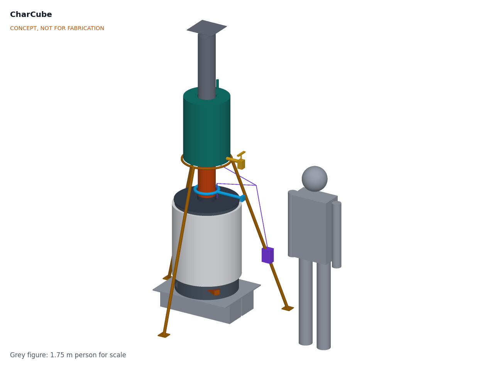

# CharCube

  

**Area:** CleanTech · **TRL:** 2 of 9 (concept formulated) · **Prototype budget:** about $300 USD · **Difficulty:** 2 of 5

Batch retort kiln that turns biomass into biochar, with a secondary burner that cleans up the syngas and a jacket that recovers heat for hot water.

[Interactive 3D model](media/viewer.html) · [Concept blueprint (PDF)](media/concept-blueprint.pdf) · [Review note](docs/REVIEW.md)

## Problem

Crop residue gets burned in the open, releasing carbon and smoke. India alone burns about 100 Mt of residue a year in the field, linked to tens of thousands of premature deaths from smoke. Design with, not for: requirements must come from co-design sessions and field trials with the intended users through a local partner.

## Concept

Batch retort kiln that turns biomass into biochar, with a secondary burner that cleans up the syngas and a jacket that recovers heat for hot water.

A 114 L steel drum packed with about 12 kg of residue sits inside a 200 L drum. Gas from the heated residue burns in the gap between the drums and again in a burner throat with secondary air, then heats about 60 L of water in an open-vented jacket around the flue. First-order estimates: about 3.4 kg of biochar and about 15 MJ of hot water per batch, for about $299 in parts. All numbers are estimates for review.

Full design precis: [docs/02-concept.md](docs/02-concept.md)

## Key components

- Nested steel drum pair: 200 L outer drum and 114 L inner retort
- Burner throat with secondary air manifold
- Flue pipe with rain cap
- Open-vented water jacket around the flue (replaces the copper coil in the first sketch; proposed, see the review note)
- Two-channel thermocouple logger

The working bill of materials is in [bom/bom.csv](bom/bom.csv).

## Safety

> Involves open flame, surfaces at 300 to 700 °C, flammable and toxic pyrolysis gas (including carbon monoxide) and water near boiling. Operate outdoors only, at least 5 m from structures and dry vegetation, with fire suppression on hand. Never open the kiln while hot, never seal the water jacket, and never use drums that held fuel or chemicals. See the safety section of the [design precis](docs/02-concept.md).

## Repository layout

| Folder | Contents |
| --- | --- |
| `docs/` | Problem, concept, requirements, calculations and design decisions |
| `cad/src/` | build123d Python source, the source of truth for all geometry |
| `cad/step/`, `cad/stl/` | Exported models for FreeCAD, other CAD tools and printing |
| `cad/drawings/` | 2D sketches and dimensioned drawings |
| `bom/` | Bill of materials |
| `electronics/` | KiCad schematics and PCB layouts |
| `firmware/` | Microcontroller code |
| `media/` | Renders, perspectives and photos |
| `build-log/` | Dated prototyping notes |

## Documentation

Controlled documents follow the portfolio [documentation standard](.kit/STANDARDS.md). Each carries a document ID (CCB-PRC-001 for the precis), a version and a revision history. Branded PDFs are built with `python .kit/render.py` and attached to GitHub Releases when a document is tagged, for example `CCB-PRC-001/v1.0`.

## Licenses

- **Hardware** (CAD, drawings, BOM, electronics): [CERN-OHL-S v2](LICENSE)
- **Software** (firmware, scripts, notebooks): [MIT](LICENSE-SOFTWARE)

Part of the open hardware portfolio at [amishchadha.com](https://amishchadha.com).
