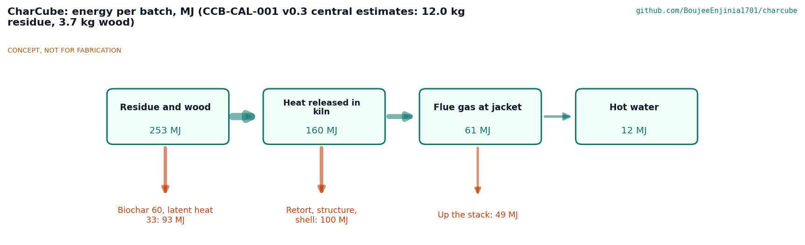
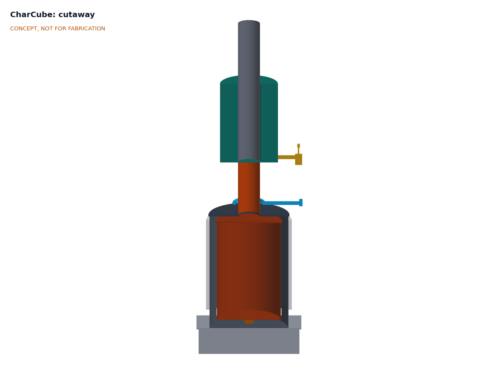
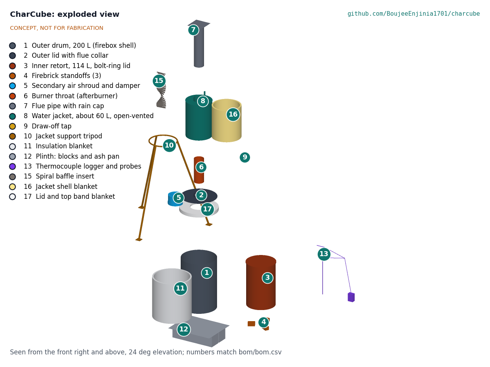

# CharCube design precis

CharCube is a batch retort kiln made from a 114 L (30 US gal) steel drum sealed inside a 200 L (55 US gal) drum. Crop residue packed into the inner drum (the retort) is heated without air; the gas it gives off escapes through holes in the retort base and burns in the gap between the drums, which keeps the process going. The flame and any unburned gas then pass through a burner throat fed with secondary air, and the hot flue gas rises past a spiral baffle through an open-vented, blanketed water jacket of about 61 L before leaving a flue 2.70 m above the ground. The TRL 3 calculations (CCB-CAL-001 v0.4) give, for the central case: 12.0 kg of air-dry residue per batch makes about 3.0 kg of biochar in a burn of about 4.5 h using about 3.7 kg of wood, and heats the water by about 45 K (11.5 MJ). Against the $320 value-engineering target (a hypothetical control target), the estimated cost of the kiln parts is $319, $1 under the target, so cost (R10) is within the target; burn time, hot water and start-up wood (R5, R6, R8) are at risk.

*Figure 1. CharCube on its block plinth with the jacket tripod, beside a 1.75 m person for scale. TRL 3 parametric model (`cad/src/model.py`).*

## How it works

1. **Load.** The retort is packed to 600 mm with 12.0 kg of air-dry residue (bundled straw, stalks, cobs or prunings), its lid is clamped on, and it stands upright on three firebrick standoffs inside the outer drum. The outer lid, carrying the burner throat and its blanket, goes on top, and the tripod carrying the drained jacket and flue is set over it so the jacket sleeve slips over the top of the throat.
2. **Light.** Dry wood is lit in the 53 mm annulus around the retort and in the space beneath it; about 1.7 kg brings the kiln up to temperature, and more is fed to keep the annulus hot (about 3.7 kg in all, central estimate). Primary air enters through four ports near the base of the outer drum.
3. **Pyrolysis.** After about 30 to 45 min the retort contents pass about 300 °C and start to release gas and tar vapor. The gas leaves through holes in the retort base, meets the fire and burns. The retort gas then supplies much of the heat, but CCB-CAL-001 shows that wood must still be fed to hold the annulus near 650 °C for the whole burn. The target is a retort core of 450 to 600 °C for at least 30 min. Heat conducts slowly into the packed charge, so the core reaches 450 °C about 4.0 h after lighting (2.9 to 6.5 h).
4. **Clean-up burn.** Everything leaving the outer drum passes the burner throat, a 160 mm steel pipe 400 mm long. A 230 mm sleeve (the air shroud) around its base admits secondary air, preheated by the throat wall, through 30 holes of 12 mm, so gas that escaped the annulus fire burns there instead of leaving as smoke and methane.
5. **Heat recovery.** The hot gas (about 400 to 465 °C at the throat exit, after mixing with the secondary air) rises through a 168 mm sleeve that forms the centre of an annular water jacket. The gas flow is laminar or transitional, so a twisted steel strip (the spiral baffle insert) swirls it against the sleeve wall, and a mineral wool blanket on the jacket shell keeps the heat in the water. The jacket is open at the top, so it cannot build pressure. Hot water is drawn from a tap at its base.
6. **Finish and cool.** When the flame at the throat dies back (about 4.5 h after lighting; 3.4 to 7.0 h), the primary ports and secondary damper are closed and the kiln is left sealed overnight. The char cools without air, so it does not burn away.
7. **Unload and log.** Next morning the tripod unit and lid are lifted off, the core probe is pulled out, the retort (about 15.5 kg with its char) is lifted out by its two U-bolt handles, and the char is tipped out, quenched or wetted, weighed and crushed. A two-channel thermocouple logger records the retort core and the throat exit every 10 s, giving a record of peak temperature and time at temperature for each batch.

*Figure 2. Energy per batch, central estimates from CCB-CAL-001 v0.2: 12.0 kg of residue at 16.0 MJ/kg (air-dry, higher heating value) plus 3.7 kg of wood at 16.2 MJ/kg (lower heating value); 2.96 kg of char at 20.2 MJ/kg; with the baffle and jacket blanket the jacket takes about 19 % of the flue gas heat.*

## Main components

Table 1. Main components. Numbers match `bom/bom.csv`, Figure 4 and CCB-DWG-001. Dimensions are the parameters of `cad/src/model.py`.

| # | Component | Choice | Notes |
| --- | --- | --- | --- |
| 1 | Outer drum (firebox shell) | 200 L open-head steel drum, 572 mm diameter x 851 mm, four 40 x 110 mm primary air ports with sliding dampers in riveted guides | Used drum; must have held a non-flammable, non-toxic product and be burned clean of paint before use |
| 2 | Outer lid with flue collar | The drum's own lid with a 150 mm hole and a 160 mm bore collar, 40 mm high, riveted on by six tabs; the throat stands on the lid inside it | Sealed with ceramic gasket rope and the drum's locking ring |
| 3 | Inner retort | 114 L open-head steel drum, 463 mm diameter x 737 mm, bolt-ring lid, eight 20 mm gas holes on a 300 mm circle in the base, a slot for the core probe, two U-bolt handles on the lid | Holds the feedstock; replaced when it scales through (estimate 50 to 100 batches) |
| 4 | Firebrick standoffs | Three half firebricks, 60 mm high, laid round the retort's edge clear of the gas holes | Leave room for fire under the retort |
| 5 | Secondary air shroud | 230 mm sleeve, 150 mm high, around the throat base; closed top riveted to the throat, open bottom with a sliding band damper | Replaces the 25 mm pipe ring of TRL 2, which could not pass the air (CCB-CAL-001 section 6); decided by Amish, 2026-09-25 (CCB-DDR-002 item 11) |
| 6 | Burner throat (afterburner) | 160 x 2 mm plain steel pipe, 400 mm long, two staggered rings of 15 air holes of 12 mm (30 in all) inside the shroud | The jacket sleeve slips over its top end; 30 holes offset the baffle pressure drop |
| 7 | Flue pipe with rain cap | 160 x 2 mm plain (not galvanized) steel, 650 mm, its foot 50 mm inside the jacket sleeve, resting on the sleeve rim on three riveted clips; rain cap on three riveted legs, 60 mm above the outlet | Outlet 2.70 m above the ground |
| 8 | Water jacket | Annular steel tank, 420 mm outside diameter x 600 mm, 2 mm walls, around an integral 168 mm flue sleeve; about 61 L at 540 mm depth; open top with a loose lid and 24 mm vent | The one welded, water-tight part; local fabricator |
| 9 | Draw-off tap | 1/2 in brass ball valve with a short nipple | Drains the jacket before moving it |
| 10 | Jacket support tripod | Three 40 x 40 x 4 mm angle legs, each bolted to a fin welded on the jacket and pinned to a bolted foot cleat and pad; feet on a 1.44 m circle | Carries the jacket and flue so the drum lid carries no water load |
| 11 | Insulation blanket | 25 mm ceramic fibre blanket held by wire mesh, air ports left clear | Halves the shell loss (CCB-CAL-001 section 4) |
| 12 | Plinth | Four concrete blocks laid as a pinwheel and a steel ash pan | Lifts the air ports clear of the ground and keeps embers off it |
| 13 | Thermocouple logger | Two type K class 1 probes (retort core, in through the drum side; throat exit, below the jacket), two MAX31855 amplifiers, a small microcontroller and microSD card, USB power bank | Strapped beside a tripod leg, away from the heat |
| 15 | Spiral baffle insert | 1.5 mm steel strip 150 mm wide, twisted half a turn per 300 mm, in the jacket sleeve, hung on a rod through the foot of the flue | Triples gas-side convection (assumption); lifts out with the flue for tar and soot cleaning; decided by Amish, 2026-09-25 (CCB-DDR-002 item 12) |
| 16 | Jacket shell blanket | 25 mm mineral wool on the jacket side, held by wire; tap, vent and lid clear | Cuts the jacket shell loss; decided by Amish, 2026-09-25 (item 12) |
| 17 | Lid and top band blanket | 25 mm ceramic fibre disc on the lid, clear of the shroud intake, with a skirt over the top band and locking ring | Saves 1.22 kW of shell loss; lifted off with the lid; decided by Amish, 2026-09-25 (item 13) |

Item 14 (fasteners, gasket rope, high-temperature sealant) is in the BOM but not modelled.

*Figure 3. Section looking from the front: retort (3) inside the outer drum (1) with the gas annulus between them, insulation (11, 17) outside and on the lid, lid (2), air shroud (5) and burner throat (6) above, then the blanketed (16) water jacket (8) around its flue sleeve with the spiral baffle (15), and the tap (9). Tripod and logger omitted.*

## Numbers from the TRL 3 calculations

All values are central estimates from CCB-CAL-001 v0.2 (`docs/04-calcs/sizing.py`), with the favourable to unfavourable range where it matters. Assumptions are listed there: air-dry feed at 12 % moisture packed to 120 kg/m³, a dry feed analysis typical of maize and cotton stalks, 28 % char yield, and the annulus held at 650 °C until the core reaches 450 °C. Nothing is measured.

Table 2. Batch, energy, carbon and cost.

| Quantity | Value | Requirement |
| --- | --- | --- |
| Retort fill | 100 L at 600 mm depth (123 L geometric) | |
| Feed per batch | 12.0 kg air-dry (10.58 kg dry); loose chopped straw would give 4.0 kg and is outside the decided feedstock | R1 met |
| Biochar | 2.96 kg (2.12 to 3.70 kg) at 28 % (20 to 35 %); about 29 % ash, 20.2 MJ/kg | R2 at risk |
| Core at 450 °C | 4.0 h after lighting (2.9 to 6.5 h) | R3 at risk |
| Burn, light to end of flaming | 4.5 h (3.4 to 7.0 h) | R5 (5 h, relaxed) at risk |
| Sealed cooling; unload | About 3.6 h; unload about 8 h after lighting, though overnight is safer | R5 16 h limit met |
| Start-up and support wood | 3.7 kg (1.7 to 9.8 kg); light-up alone 1.7 kg | R8 at risk |
| Heat released in the kiln | 160 MJ (125 to 247 MJ) | |
| Shell loss while burning | 4.47 kW: blanketed side 125 °C, blanketed lid 120 °C, bare lid under the shroud 257 °C, throat 223 °C | |
| Stack draft | 16.7 Pa over 2.43 m; peak losses about 7 Pa including the gas holes and baffle, margin 2.4 | R4 air paths sized |
| Secondary air holes | 33.9 cm² (30 x 12 mm) provided against 28.5 cm² needed at peak | R4 |
| Heat to water | 11.5 MJ (9.0 to 19.1 MJ) with the baffle and jacket blanket; 61 L raised about 45 K; no boiling in any case, but the long burn comes within 1.5 MJ of it | R6 at risk |
| Carbon stored for 100 years | 1.30 kg C, 4.8 kg CO₂ per batch (2.96 kg x 0.55 x 0.80) | |
| Methane penalty | 2.0 kg CO₂e per batch at the retort field average (24 g CH₄ per kg char, GWP100 28) | R4 not verifiable |
| Net removal | 2.8 kg CO₂e per batch (2.0 to 3.5); 0.70 t CO₂e and about 740 kg of char a year at 250 batches; about 3.0 t of residue kept out of open burning | |
| Mass | About 97 kg without plinth and water; lift unit (tripod, drained jacket with baffle and blanket, flue) 47.4 kg for two people; retort with char 15.5 kg; full jacket 85 kg | R11 met |
| Height | Flue outlet 2.70 m; footprint about 1.44 m across the tripod feet | R12 met |
| Parts cost | $319 against $320 (lines 15 to 17 add $21); safety kit (about $40) listed separately | R10 met ($1 margin) |

The main changes from TRL 2: the char carries its ash, so its mass and heating value are lower; the burn is set by conduction into the charge and is longer; a longer burn needs more wood; and the plain jacket sleeve transfers about a third of the heat assumed at TRL 2. The changes accepted on 2026-09-25 (CCB-DDR-002) recover most of that: the baffle and jacket blanket take hot water from 6.4 to 11.5 MJ, and the lid blanket takes wood from 5.8 to 3.7 kg, at a cost of $21 and a lower draft margin.

## Key design choices

Items 1 to 8 and 10 of the TRL 2 review (CCB-DDR-001) and items 11 to 16 of the TRL 3 review (CCB-DDR-002) were decided by Amish on 2026-09-25: go with the recommendation.

- **Nested-drum retort rather than a flame-curtain kiln.** Decided by Amish, 2026-09-25. A Kon-Tiki cone costs less and needs no start-up wood, but it is open, its heat cannot be recovered and its yield on straw is lower.
- **Annular water jacket on the flue rather than a copper coil.** Decided by Amish, 2026-09-25. It needs no pump or raised tank and cannot build pressure. CCB-CAL-001 showed it recovers only about 6.4 MJ per batch with a plain sleeve, so a spiral baffle insert and a jacket blanket were added (decided by Amish, 2026-09-25, CCB-DDR-002 item 12), giving about 11.5 MJ.
- **Burner throat with preheated secondary air.** Decided by Amish, 2026-09-25. The TRL 3 sizing replaced the 25 mm pipe ring with an air shroud (decided by Amish, 2026-09-25, CCB-DDR-002 item 11).
- **Jacket carried on a tripod, not on the drum lid.** Decided by Amish, 2026-09-25. The drained lift unit weighs 47.4 kg, 23.7 kg each for two people. The legs bolt to three fins welded on the jacket (CCB-DDR-003).
- **Target feedstock.** Decided by Amish, 2026-09-25: bundled straw and mixed stalks and cobs first; a straw press is a separate project.
- **Temperature logging as standard.** Decided by Amish, 2026-09-25. Class 1 probes meet the restated R9, ±5 °C to 700 °C and indicative above (CCB-DDR-002 item 15).
- **Insulation blanket.** Decided by Amish, 2026-09-25: ceramic fibre for the prototype, now also on the lid and top band (CCB-DDR-002 item 13), which saves 1.22 kW.
- **Burn time target.** Decided by Amish, 2026-09-25: R5 relaxed to 5 h (CCB-DDR-002 item 14).
- **Value-engineering target.** Value-engineering target: $320 (a hypothetical control target, not a limit) for the kiln parts; the safety kit is required and listed separately (decided by Amish, 2026-09-25). With lines 15 to 17 the estimated cost of the kiln parts is $319, $1 under the target.
- **Name.** Decided by Amish, 2026-09-25: keep CharCube.

*Figure 4. Exploded view with BOM numbers.*

## Safety

> **Safety:** CharCube is a fire. CCB-CAL-001 estimates about 125 °C on the blanket and 170 to 260 °C on average over the bare port band, lid and throat, with hotter spots at gaps, the collar and the air ports; the gas inside is at 400 to 650 °C, and the char stays hot enough to reignite for many hours. Run it outdoors only, on bare soil or paving, at least 5 m from buildings, fences, dry vegetation and residue piles, never under trees or roofs, and never during a local burning ban or high wind. Keep a fire extinguisher or at least 50 L of water and a shovel at hand, keep children and animals outside a marked 3 m circle, and wear heat-resistant gloves, eye protection and closed shoes. This safety kit is required for every batch; it is listed separately from the kiln parts cost (CCB-REQ-001 R10).

> **Safety:** Pyrolysis gas is flammable and toxic (carbon monoxide, hydrogen, methane and tar vapor). Never open the retort or the outer lid while the kiln is hot: air entering a hot retort can ignite the gas suddenly and throw flame. Do not stand over the flue or downwind of the throat, never run the kiln in or near an enclosed space, and stop a batch that smokes heavily rather than leaving it.

> **Safety:** With the baffle insert and jacket blanket, a long batch brings the water close to boiling (CCB-CAL-001 v0.2 estimates 19.1 MJ against 20.6 MJ to boil 61 L from 20 °C), and a warm start or a low level would boil it. It must stay open to the air: never plug the vent or fit a sealed lid, and never connect it to household plumbing or a closed tank. Keep it at least three-quarters full while the kiln runs, never add cold water to a jacket that has boiled dry, and draw hot water slowly through the tap. Scalds from 80 °C water happen in under a second.

- **Used drums.** Use only open-head drums that held non-flammable, non-toxic products. Never cut, drill or grind a drum that held fuel, solvent or pesticide, and burn paint and liners off outdoors, upwind, before first use. Do not use galvanized pipe or drums: heated zinc gives off toxic fumes.
- **Char handling.** Tip char out only after overnight cooling, onto bare ground, and quench or wet it before bagging. Dry char dust is a fire and inhalation hazard; wet it and wear a dust mask when crushing.
- **Lifting.** Drain the jacket before moving it. The tripod, jacket and flue unit weighs about 47 kg empty and needs two people; a full jacket weighs about 85 kg and must never be moved; move it only when the flue is cool enough to handle with gloves.
- **Sharp edges.** Cut drum edges and air ports must be deburred or folded.
- **Baffle and blankets.** Lift the baffle insert out with the flue only when cool, and scrape tar outdoors with gloves. Wear a dust mask when cutting ceramic fibre or mineral wool, and keep the lid blanket clear of the shroud intake so the secondary air is not blocked.
- **Temperature logger.** Keep the logger and power bank on the tripod leg away from the heat; thermocouple leads must be rated for the temperature where they run.

## Open questions

The TRL 3 open questions on gas holes, secondary air, draft, jacket heat transfer and surface temperatures are answered in CCB-CAL-001. What remains:

- How much does the spiral insert really raise heat transfer, and how fast does it foul? The factor of 3 is an assumption.
- Is the 47 kg two-person lift acceptable to users, or is a swinging arm needed?
- How fast does tar foul the jacket sleeve, and how is it cleaned?
- Establish the batch record needed for a biochar certificate, even if certification stays out of scope.
- First region, residue and partner: proposed, awaiting Amish; partners are chosen per area later.
- Validate feedstock, packing, batch size, water use and price with users through a local partner.

TRL 4 (building and logging batches) is on hold by Amish's instruction.

Concept media: [blueprint sheet](../media/concept-blueprint.pdf), [interactive 3D model](../media/viewer.html). General arrangement: [CCB-DWG-001](../cad/drawings/CCB-DWG-001.pdf). Prototype build plan: [CCB-BLD-001](05-build-plan.md). Calculations: [CCB-CAL-001](04-calcs/01-sizing.md).
